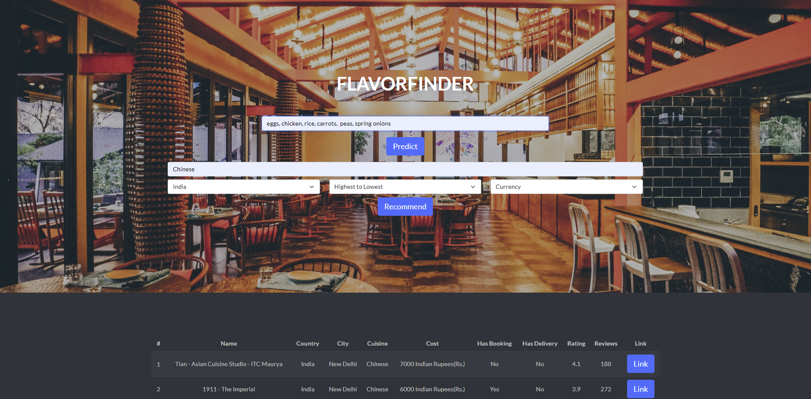

# FlavorFinder Cuisine Predicter and Restaurant Recommender System

This project involves the usage of 7 ML models from the scikit-learn library in Python, to predict a type of cuisine (such as Indian, Thai, etc.) given ingredients, then given that cuisine it attempts to recommend restaurants across the world that provide that type of cuisine.

The following models were used:
1. Logistic Regression
2. Multinomial Naive Bayes
3. Bernoulli Naive Bayes
4. KNN
5. Linear SVM
6. Cramer SVM
7. SGD

The highest accuracy attained was 78.8%. There are one of 20 types of cuisines from the train.json file, so generalizations were made from the zomato.csv file to map the missing and extra cuisines to the original trained model. 

Django was used to incorporate a web-based user interface to be able to take input and show output.

In order to run this project, you'll need to use pgAdmin and import the csv file. This can be a hassle to do, as pgAdmin may even require more configuration to work. Then, you'll use   
`py manage.py runserver`  
in the terminal to run the project.
